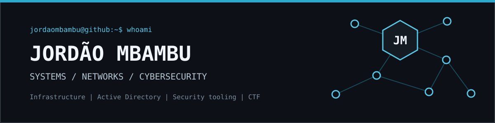

  

  
  
  

## About

I am a Networks & Telecommunications student specializing in Cybersecurity at
the IUT of Roanne. Since February 2026, I have also been working as an
apprentice Systems, Networks & Security Technician at IT Contact.

My work sits between infrastructure and security: Windows Server, Active
Directory, network services, monitoring, security testing and practical
automation. I also compete in CTFs with **Hackcess** and publish tools,
technical notes and sanitized writeups.

## Current Focus

- Building small, useful tools for network and security workflows.
- Strengthening Active Directory, Linux and Windows infrastructure skills.
- Practicing network, web and wireless security through labs and CTFs.
- Documenting solutions clearly enough to be reused and maintained.

## Featured Projects

| Project | Purpose |
|:--|:--|
| [Sublive](https://github.com/JordaoMbambu/Sublive) | Fast parallel subdomain alive checker that separates live, dead and errored targets. |
| [eduroam-connect](https://github.com/JordaoMbambu/eduroam-connect) | Bash helper for Eduroam and other WPA/WPA2-Enterprise networks, with rfkill, EAP and clock/certificate diagnostics. |
| [AD-Tools-Installer](https://github.com/JordaoMbambu/AD-Tools-Installer) | Automates the installation of Active Directory assessment tools for lab environments. |
| [Vlan_Allocator](https://github.com/JordaoMbambu/Vlan_Allocator) | Plans IPv4 subnet allocations with VLSM to reduce address waste. |
| [SAE-21](https://github.com/JordaoMbambu/SAE-21) | Campus network lab covering VLANs, routing, NAT and ACLs in Cisco Packet Tracer. |

## Toolbox

**Systems & Infrastructure**

**Security & Monitoring**

**Scripting & Web**

## Selected Highlights

| Event | Result |
|:--|:--|
| CTF Inter-IUT 2026 | **1st place**, team result with Hackcess |
| CSAW CTF Europe 2025 | **Top 5 individual in Europe** |
| Hack The Box Season 10 | **26/26 flags**, rank 429 out of 12,000+, Holo tier |

## Security Platforms

  
  
  

